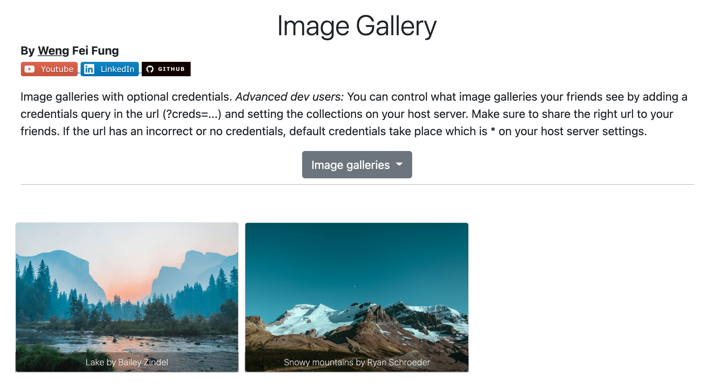

# Image Gallery Web App

:page_facing_up: Description:
---
By Weng Fei Fung

Image galleries with optional credentials. Control what images your friends see with different URLs.

:open_file_folder: Table of Contents:
---
- [Description](#description)
- [Preview](#camera-preview)
- [Installation and Usage](#minidisc-installation-and-usage)
- [Advanced Use](#computer-advanced-use)

:camera: Preview:
---

## :minidisc: Installation and Usage:
Run on a node server. This image gallery lets you send different links to friends that controls which images they can see.

## :computer: Advanced Use:
You can control what image galleries your friends see by adding a credentials query in the url (?creds=...) and setting the collections on your host server. Make sure to share the right url to your friends. If the url has an incorrect or no credentials, default credentials take place which is * on your host server settings.

The setting is at credentials.json. The image galleries are in public/collections.
